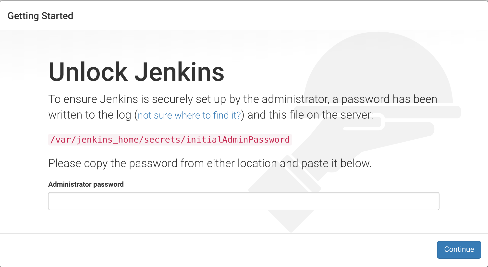
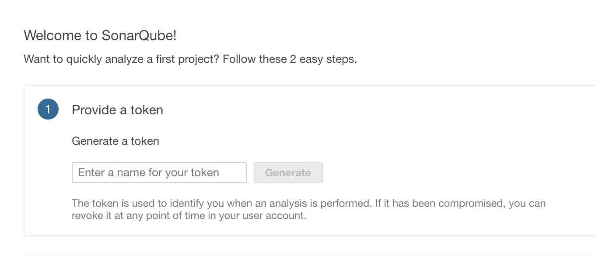

# Toolchain Demonstration

This goal of this project is to provide a fully functional CI/CD pipeline that is portable, easy to setup, does not rely on a network connection, uses only open source tooling and can run on a laptop with 16 GB of RAM.

**Important** This is purely a demonstration of a CI/CD pipeline. Usernames and passwords have not been changed from the default. For an operational system, it's important that all credentials are unique and stored as configurable secrets. Read the Configuring Secrets section for details.  

## Pipeline Foundation

All tools in this pipeline run in Docker containers. The containers are written to be single-purpose. For example, the build container runs Gradle and the repository container runs Nexus 3 OSS. Any container in the pipeline can be removed (deleted) and recreated without losing history.

The continuous deployment (CD) part of the pipeline relies on Kubernetes as the final deployment target. To achieve Kubernetes deployment without a network connection and to make it as simple as possible, the demonstration uses Docker Kubernetes integration. I explain how to configure this in the setup section.

## Prerequisites

Docker v. 1.8 or later for OS X or Windows
16 GB of RAM
The Git client for your operating system
The cURL client for your operating system

### Configuring Docker After Setup in OS X or Windows

These instructions are current as of Docker v 2.0.0.3. If you are on a later version, configuration might be different. Follow the operating system-specific sections for your host operating system. All of the steps are either completed from Docker > Preferences in OS X or Docker > Settings in Windows.

#### OS X Enable Kubernetes

1. In Docker for Mac, enable Kubernetes integration from the Docker > Preferences > Kubernetes tab.

#### Windows Enable Kubernetes

1. In Docker for Windows, enable Kubernetes integration from Docker > Settings > Kubernetes option.

2. After clicking Apply, follow the instructions to complete the installation.

#### OS X Configure Orchestration

1. From the Kubernetes tab/option, ensure or select the Kubernetes orchestration radio button.

#### Windows Configure Orchestration

1. From the Kubernetes tab/option, ensure or select the Deploy Docker Stacks to Kubernetes by default check box.

#### OS X Increase Resource Allocation

1. From the Advanced tab, increase **CPUs** to a minimum of 4, **Memory** to a minimum of 7 GB and **Swap** to 2 GB

2. Click Apply & Restart

#### Windows Increase Resource Allocation

1. From the Advanced tab, increase **CPUs** to a minimum of 2, **Memory** to a minimum of 7168 MB and **Swap** to 2048 MB

2. Click Apply

### Clone the Toolchain Demo Repository

1. Once Docker and Kubernetes are restarted, open a command prompt.

2. Navigate to a directory where you want to clone this project/repository.

3. Clone the repository:

   ``` console
   git clone https://github.com/ewilansky/toolchain_demo.git`
   ```

4. Change directory to the root of the repository:

   ``` console
   cd toolchain_demo
   ```

### Configuring Credentials

This solution uses Docker secrets to demonstrate an approach for protecting account credentials. Credentials should never be stored in source control, which is why I did not make these files part of the demonstration. Therefore, before running this solution, you must follow these steps.

#### OS X

1. From bash in the toolchain_demo directory, type:

  ``` console
    $ ./scaffoldsecrets.sh

    secrets directory and files created. Please add passwords
  ```

#### Windows

1. From powershell in the toolchain_demo directory, type:

   ``` console
   ./scaffoldsecrets.ps1

   secrets directory and files created. Please add passwords
   ```

   >Note: If you are unable to run this script because of your powershell execution policy, you have two choices. Either allow the script to run unrestricted or manually create the secrets directory and all files specified in the script. To change your powershell execution policy, search the web for powershell set-executionpolicy.

#### OS X and Windows

For this demo, use your favorite text editor to write the following credential values to the first line of the file. Be careful to not add spaces to the end of the values you enter. Note in a non-demonstration environment, be sure to use different credentials.

1. In the nexus_usr.txt file, use this value: `nexusadmin`

2. In all other files with a prefix ending in _usr.txt, use this value: `admin`

3. In all files with a prefix ending in _password.txt, use this value: `t7jsqtnL`

### Setting Hostname Alias

1. This solution uses a certificate for the reverse proxy. The certificate commonname (CN) is my.dev. Therefore, add this hostname to your hosts file. The entry should look something like this:

   `127.0.0.1 localhost my.dev`

### Starting the Pipeline

1. Verify that there are no containers already running:

   ``` console
   $ docker ps

     CONTAINER ID        IMAGE               COMMAND             CREATED             STATUS              PORTS               NAMES
   ```

   Notice that no running containers were returned. If `docker ps` returns containers, I suggest you stop any running containers. This is a good idea to ensure you have enough memory resources to run the containers and to avoid port collisions.

2. Ensure that you are in the toolchain_demo directory and then start the pipeline containers:

   ``` console
   $ docker-compose up -d
   ...
   a bunch of image build commands and some warning for non-existent images
   ... then,
   Starting nginx     ... done
   Starting gogs      ... done
   Starting postgres  ... done
   Starting nexus     ... done
   Creating sonarqube ... done
   Creating jenkins   ... done
   ```

   The previous command started six containers that support the pipeline.

3. To verify the containers are running:

   ``` console
   $ docker ps

   CONTAINER ID        IMAGE                    COMMAND                  CREATED              PORTS                                           NAMES
   3dd98f433c97        ahl/jenkins:v1           "/sbin/tini -- /usr/…"   About a minute ago   0.0.0.0:8080->8080/tcp, 0.0.0.0:50000->50000/tcp   jenkins
   0114a4067be5        ahl.sonar:v1             "/usr/local/setrun-e…"   About a minute ago   0.0.0.0:9000->9000/tcp, 0.0.0.0:9092->9092/tcp     sonarqube
   c237e61eafcf        ahl.nginx:v1             "nginx-debug -g 'dae…"   30 hours ago         80/tcp, 0.0.0.0:18445-18447->18445-18447/tcp       nginx
   ef81714a53a3        postgres:10.7            "docker-entrypoint.s…"   3 days ago           0.0.0.0:5432->5432/tcp                             postgres
   5c835c8fdc25        gogs/gogs                "/app/gogs/docker/st…"   3 days ago           0.0.0.0:10022->22/tcp, 0.0.0.0:10080->3000/tcp     gogs
   293d34ce83b6        sonatype/nexus3:latest   "sh -c ${SONATYPE_DI…"   4 days ago           0.0.0.0:8081->8081/tcp                             nexus
   ```

   If you see nore containers, you already run Docker and have running containers. Unless you have significant memory resources, you should stop the other containers while running this demonstration. Also, it's possible that existing, running containers could be using the same ports configured for this demonstration. Stopping the other running containers is sufficient to avoid port collisions. If you're not sure how to stop containers, read about the `docker stop` command option.

### Running the toolchain

There are web-based UI's for Jenkins, Sonarqube and Nexus. To verify they are functional and to run the pipeline, follow these steps:

#### Jenkins

The first time you attempt to access the Jenkins UI, you will need to unlock it by setting an initial administrator password.

1. On your host, browse to http://localhost:8080 and the following screen will appear:



The location of the initialAdminPassword is in the jenkins_home directory on your host. The  path starting from the toolchain_demo directory is: ./jenkins_home/secrets/initialAdminPassword. Following the remaining screens that Jenkins presents. You can accept the standard plugins for this simple setup.

TODO: CONTINUE FROM HERE. JENKINS PLUGINS ARE REQUIRED, JENKINS FILE DEFINITION DIDN'T APPEAR AND SONARQUBE ISN'T OPERATIONAL

logon id: admin  
password: admin

The sample project "Demo Pipeline" should appear. You can run the project directly from the Jenkins classic interface by clicking the play icon on the right side of the row.

Alternatively, you can use the Blue Ocean plugin UI to run the project.

1. Click the Open Blue Ocean link in the left navigation.
2. From the Blue Ocean UI, click the Demo Pipeline project then click the Branches tab.
3. Hover your mouse to the far right of the row to reveal the Play icon and click it to run the job.

To learn more about Jenkins, visit https://jenkins.io

#### Sonarqube

http://localhost:9000  
login id: admin  
password: admin

A new sonar database was created for SonarQube when docker-compose ran. In this new database, you must generate a logon token. Gradle uses this token to access Sonarqube for code analysis. Therefore, when you logon, you will be presented with this screen:



1. Enter sonar in the token name box and click Generate
2. Copy the token value to your clipboard and click Continue
3. Edit ./spring-boot-demo/gradle.properties and replace the token value for systemProp.sonar.login.
4. Check-in the updated gradle.properties file to the SCM [TODO: SETUP LOCAL GIT SERVER]

If you ran the pipeline successfully, you will see the spring-boot-demo project appearing. Click on the spring-boot-demo link to see code metrics in SonarQube.

To learn more about Sonarqube, visit https://www.sonarqube.org

#### Nexus

http://localhost:8088  
login id: admin  
password: admin123

If you ran the pipeline succesfully, you will see the project dependencies cached in the maven-central repository.

1. In the left navigation, click Browse.
2. From the table that appears, click maven-central to see expandable trees showing project dependencies.

The pipeline also copied the spring-boot-demo jar to maven-snapshots.

1. In the left navigation, click Browse.
2. From the table that appears, click maven-snapshots to see an expandable tree of the spring-boot-demo snapshot.

To learn more about the Nexus Repository Manager, click the question mark icon on the right side of the top navigation menu and then select Documentation.

#### Kubernetes

To verify that the container has been built and deployed to Kubernetes:

1. Open a commandline and type:  
      `kubectl get deployments`  
   You should see the springboot-demo deployment listed
2. Then type:  
   `kubectl get services`  
   You should see two entries, one for the Kubernetes cluster IP and a second one for the spring-bootdemo load balancer.  

To see the application running, navigate to http://localhost:8081/api/books or use curl. In either case, the application will return two JSON formatted book entries.

## More About This Demonstration

There are quite a few more tools in the toolchain that weren't covered in the quick start above. For example, Gradle runs many of the build tasks in the pipeline. The following diagram shows the entire pipeline:


## Tools Configuration

The following containers that you generated earlier are setup to be long-running and are configured in docker-compose:

- Jenkins
- Nexus
- Sonarqube
- Postgres

Except for Postgres, you interacted directly with the other containers. Postgres in the database used to persist data collected by SonarQube.

While the gradle wrapper (gradlew) is part of the project, the pipeline does not use the wrapper. Instead, there is a separate Gradle container generated to run the tasks defined in Jenkins. The gradle wrapper is useful for troubleshooting and developing the pipeline, which is why I left it in place.

The spring-boot-demo jar is packaged in the openjdk:8-jdk-alpine image by docker in the pipeline. This image is the source of the container that gets deployed into Kubernetes.

## More About the Use of Docker Secrets in this Demonstration

Tools in the CI/CD toolchain use credentials for access control. This section provides more information on how logon credentials stored locally and outside of source control are used by systems requiring credentials.

### Secrets setup in this Toolchain Demo to Secure Credentials

1. The scaffolding script run in the Configuring Credentials section earlier, created a secrets directory and populated it with files used by various Docker containers. The convention used for these files are:

   [*toolname*]_usr.txt and [*toolname*]_password.txt where *toolname* is the specific tool, such as postgres or sonarqube.

   Docker also allows you to configure secrets in memory rather than using files. This is a perfectly fine way to do it as well and some people prefer it.

At the root of docker-compose.yml, Docker secrets are globally configured. For example:

    secrets:
      postgres-user:
        file: ./secrets/postgres_usr.txt
      postgres-passwd:
        file: ./secrets/postgres_password.txt
      sonarqube-user:
        file: ./secrets/sonarqube_usr.txt
     sonarqube-passwd:
        file: ./secrets/sonarqube_password.txt

and then locally configured to scope each credential set down to the right service. How the secrets are locally scoped are described in the tool-specific sections next.

### Postgres Credential Management

The official Postgres image supports the use of Docker secrets by recognizing certain variable names followed by _FILE. You can read more about this in the official Postgres Docker repository at **TODO**. In the case of this demonstration, Docker secrets are passed to the Postgres container using the following two variable names and values in the db service section of docker-compose.yml:

    POSTGRES_PASSWORD_FILE: /run/secrets/postgres-passwd
    POSTGRES_USER_FILE: /run/secrets/postgres-user

These secrets defined globally in docker-compose-yml are scoped to the Postgres container via the simple secrets syntax also in the db service section of docker-compose.yml:

    secrets:
      - postgres-user
      - postgres-passwd

### Sonarqube Credential Management

The official Sonarqube image does not support Docker secrets. Therefore, this toolchain demo includes a custom Sonarqube image contained in the **build_def_sonar** folder. When this image is built, Docker copies the setrun-env.sh script into the image via dockerfile. This script looks in the /usr/local/secrets folder inside the image for credential information.

The Sonarqube service section of Docker-compose.yml locally binds /usr/local/secrets into the container, as shown:

    secrets:  
       - source: sonarqube-passwd  
         target: /usr/local/secrets/sonarqube-passwd
       - source: sonarqube-user  
         target: /usr/local/secrets/sonarqube-user

### Nexus Repository Credential Management

TODO