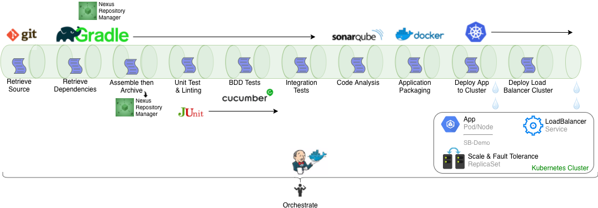

# Toolchain Demonstration

This goal of this project is to provide a fully functional CI/CD pipeline that is portable, easy to setup, does not rely on a network connection, uses only open source tooling and can run on a laptop with 16 GB of RAM.

**Important** This is purely a demonstration of a CI/CD pipeline. Usernames and passwords have not been changed from the default. For an operational system, it's important that all credentials are unique and stored as configurable secrets. Read the Configuring Secrets section for details.  

## Pipeline Foundation

All tools in this pipeline run in Docker containers. The containers are written to be single-purpose. For example, the build container runs Gradle and the repository container runs Nexus 3 OSS. Any container in the pipeline can be removed (deleted) and recreated without losing history.

The continuous deployment (CD) part of the pipeline relies on Kubernetes as the final deployment target. To achieve Kubernetes deployment without a network connection and to make it as simple as possible, the demonstration uses Docker Kubernetes integration. I explain how to configure this in the setup section.

## Prerequisites

Docker v. 8.06.1-ce for the Mac or Windows
16 GB of RAM
The Git client for your operating system

## Setup Instructions Specific to Your Host Operating System

1. In Docker for Mac, enable Kubernetes integration from the Docker > Preferences > Kubernetes tab.

or

1. In Docker for Windows, enabled Kubernetes integration from Docker > ??

### Setup instructions for Mac or Windows systems

1. From the Kubernetes tab, ensure or select the Kubernetes orchestration radio button.

2. Once Docker and Kubernetes are started, open a command prompt.

3. Navigate to a directory where you want to clone this project/repository.

4. Clone the repository:

   `git clone https://github.com/ewilansky/toolchain_demo.git`

5. Change directory to the root of the repository:

   `cd toolchain_demo`

6. Verify that there are no containers already running:
  
   `docker ps`

   If this command returns containers, I suggest you stop any running containers. This is a good idea to ensure you have enough memory resources to run the containers and to avoid port collisions.
   In bash, you can stop all running containers by typing:

   `docker stop $(docker ps -q)`

7. Start the long-running pipeline tools (see Long Running Containers for details)

   `docker-compose up -d`

   This command will start four containers that support the pipeline. You should see something like this:  
  
   Creating network "toolchain_demo_tc-net" with the default driver  
   Creating nexus     ... done  
   Creating sonarqube ... done  
   Creating jenkins   ... done  
   Creating postgres  ... done  

8. To verify the containers are running:

   `docker ps`

   This command should return the names of four containers: nexus, jenkins, sonarqube and postgres. If you see nore containers, you already run Docker and have running containers. Unless you have significant memory resources, I suggest you stop the other containers while running this demonstration. Also, it's possible that existing, running containers could be using the same ports configured for this demonstration. Stopping the other running containers is sufficient to avoid port collisions. If you're not sure how to stop containers, read about the *docker stop* command option.

### Running the toolchain

There are web-based UI's for Jenkins, Sonarqube and Nexus. To verify they are functional and to run the pipeline, follow these steps:

#### Jenkins

http://localhost:8080  
logon id: admin  
password: admin

The sample project "Demo Pipeline" should appear. You can run the project directly from the Jenkins classic interface by clicking the play icon on the right side of the row.

Alternatively, you can use the Blue Ocean plugin UI to run the project.

1. Click the Open Blue Ocean link in the left navigation.
2. From the Blue Ocean UI, click the Demo Pipeline project then click the Branches tab.
3. Hover your mouse to the far right of the row to reveal the Play icon and click it to run the job.

To learn more about Jenkins, visit https://jenkins.io

#### Sonarqube

http://localhost:9000  
login id: admin  
password: admin

If you ran the pipeline successfully, you will see the spring-boot-demo project appearing. Click on the spring-boot-demo link to see code metrics in SonarQube.

To learn more about Sonarqube, visit https://www.sonarqube.org

#### Nexus

http://localhost:8088  
login id: admin  
password: admin123

If you ran the pipeline succesfully, you will see the project dependencies cached in the maven-central repository.

1. In the left navigation, click Browse.
2. From the table that appears, click maven-central to see expandable trees showing project dependencies.

The pipeline also copied the spring-boot-demo jar to maven-snapshots.

1. In the left navigation, click Browse.
2. From the table that appears, click maven-snapshots to see an expandable tree of the spring-boot-demo snapshot.

To learn more about the Nexus Repository Manager, click the question mark icon on the right side of the top navigation menu and then select Documentation.

#### Kubernetes

To verify that the container has been built and deployed to Kubernetes:

1. Open a commandline and type:  
      `kubectl get deployments`  
   You should see the springboot-demo deployment listed
2. Then type:  
   `kubectl get services`  
   You should see two entries, one for the Kubernetes cluster IP and a second one for the spring-bootdemo load balancer.  

To see the application running, navigate to http://localhost:8081/api/books or use curl. In either case, the application will return two JSON formatted book entries.

## More About This Demonstration

There are quite a few more tools in the toolchain that weren't covered in the quick start above. For example, Gradle runs many of the build tasks in the pipeline. The following diagram shows the entire pipeline:

## Tools Configuration

The following containers that you generated earlier are setup to be long-running and are configured in docker-compose:

- Jenkins
- Nexus
- Sonarqube
- Postgres

Except for Postgres, you interacted directly with the other containers. Postgres in the database used to persist data collected by SonarQube.

While the gradle wrapper (gradlew) is part of the project, the pipeline does not use the wrapper. Instead, there is a separate Gradle container generated to run the tasks defined in Jenkins. The gradle wrapper is useful for troubleshooting and developing the pipeline, which is why I left it in place.

The spring-boot-demo jar is packaged in the openjdk:8-jdk-alpine image by docker in the pipeline. This image is the source of the container that gets deployed into Kubernetes.

## Configuring Secrets

Each tool in the CI/CD pipeline uses different methods for storing secrets. This section details how to configure each tool requiring a logon with credentials stored securely or at least separate of the actual infrastructure as code files.  

**TODO:** fill in this section for each toolchain tool